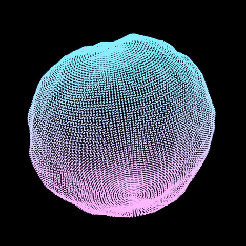

# Point Cloud Blob

> Procedural glowing point-cloud blob generated entirely with Python (`bpy`) and Blender 5 Geometry Nodes — with a real-time interactive WebGL audio experience.

[](https://alevoldon.github.io/point-cloud-surface/interactive.html)

<div align="center">

[](https://alevoldon.github.io/point-cloud-surface/)
[](https://alevoldon.github.io/point-cloud-surface/interactive.html)
[](https://alevoldon.github.io/point-cloud-surface/interactive.html)
[](LICENSE)
[](https://www.blender.org/)

</div>

---

## ✨ Previews

| Animated preview (GIF) | Interactive WebGL + Audio |
|:---:|:---:|
| [](render/preview.gif) | [](https://alevoldon.github.io/point-cloud-surface/interactive.html) |
| Rendered in Blender · Eevee Bloom | Three.js · GLSL shaders · Web Audio API |

🔗 **[Open interactive experience →](https://alevoldon.github.io/point-cloud-surface/interactive.html)**  
🔗 **[Open animation preview →](https://alevoldon.github.io/point-cloud-surface/)**

---

## 🎛️ Interactive Experience

The browser experience at `docs/interactive.html` is a fully interactive audiovisual tool — works on **desktop and mobile**.

### 📱 Mobile Layout
On screens narrower than 640 px:
- The blob fills the full screen — no overlapping panels
- A floating **⚙** button (bottom-right) slides up a **bottom sheet** with all controls
- Tap the blob to dismiss the panel
- Audio strip is compact and pinned to the bottom

### 🎵 Audio
| Feature | Detail |
|---|---|
| Background tracks | *Digital Bloom 1* and *Digital Bloom 2* cycle automatically |
| Crossfade | 2.5 s smooth crossfade between tracks |
| Controls | Play / Pause, Previous / Next, seekable progress bar, volume |
| Visualiser | 18-bar real-time FFT spectrum |

### 🧠 Audio Reactivity
Enable **♪ Sync** mode — the blob displacement amplitude is driven by bass frequencies in real-time. The blob breathes and pulses in sync with the music.

### 🎨 Visual Controls (right panel / bottom sheet on mobile)
| Control | Description |
|---|---|
| Color A / Color B | Live gradient colour pickers (GLSL uniforms) |
| Noise Scale | Blob shape from smooth to spiky |
| Animation Speed | Deformation speed multiplier |
| Point Size | Particle radius |
| Bloom Intensity | Glow strength |
| Bloom Radius | Glow spread |
| 📷 Save | Download current frame as PNG |

---

## 🧠 How It Works

| Step | Detail |
|---|---|
| Base mesh | 160 × 112 segment UV sphere |
| Displacement | Two 4D noise layers (scale 1.45 and 3.2) summed with mapped amplitude |
| Colour | Emissive blue → magenta gradient driven by world-space Z + noise variation |
| Glow | Eevee Next Bloom (intensity 0.035, radius 4.8) |
| Animation | Keyframed rotation, scale, and noise phase — seamless 72-frame loop |
| Web preview | Three.js GLSL shaders + UnrealBloom + Web Audio API FFT |

---

## 🚀 Quick Start

> **Requires:** Blender 5.x installed at the default path on Windows.

### Generate scene + still render

```powershell
& "C:\Program Files\Blender Foundation\Blender 5.0\blender.exe" `
  -b --python ".\make_point_cloud_blob.py" `
  -- `
  --blend ".\point_cloud_blob.blend" `
  --render ".\render\point_cloud_blob.png"
```

### Generate scene + animation frames

```powershell
& "C:\Program Files\Blender Foundation\Blender 5.0\blender.exe" `
  -b --python ".\make_point_cloud_blob.py" `
  -- `
  --blend ".\point_cloud_blob.blend" `
  --render ".\render\point_cloud_blob.png" `
  --animate ".\render\animation\frame_" `
  --frames 72 `
  --fps 24
```

> Animation frames are written to `render/animation/` and ignored by git.

### Customise colours and noise

```powershell
& "C:\Program Files\Blender Foundation\Blender 5.0\blender.exe" `
  -b --python ".\make_point_cloud_blob.py" `
  -- `
  --color1 "#ff4400" `
  --color2 "#ffee00" `
  --noise-scale 2.0 `
  --render ".\render\custom.png"
```

| Argument | Default | Description |
|---|---|---|
| `--blend` | `point_cloud_blob.blend` | Output `.blend` path |
| `--render` | `render/point_cloud_blob.png` | Output still-render path |
| `--animate` | `render/animation/frame_` | Output animation frame prefix |
| `--frames` | `96` | Number of animation frames |
| `--fps` | `24` | Frames per second |
| `--color1` | `#e666ff` | Gradient start colour (magenta end) |
| `--color2` | `#38bdff` | Gradient end colour (blue end) |
| `--noise-scale` | `1.0` | Displacement noise scale multiplier |

---

## 📁 Project Structure

```
.
├── make_point_cloud_blob.py      # bpy scene generator (main script)
├── point_cloud_blob.blend        # generated Blender scene
├── render/
│   ├── point_cloud_blob.png      # still render
│   └── preview.gif               # animated GIF (from Blender frames)
├── docs/
│   ├── index.html                # animation preview (sampled PNG frames)
│   ├── interactive.html          # real-time WebGL + audio experience
│   └── assets/
│       ├── animation/            # sampled PNG frames for web preview
│       └── audio/                # background music tracks
├── FULL_PROCESS_GUIDE.md
├── BLENDER_UI_STEP_BY_STEP.md
└── PORTFOLIO_TEXTS.md
```

---

## 📚 Documentation

| Document | Description |
|---|---|
| [FULL_PROCESS_GUIDE.md](FULL_PROCESS_GUIDE.md) | Complete step-by-step build process |
| [BLENDER_UI_STEP_BY_STEP.md](BLENDER_UI_STEP_BY_STEP.md) | Recreate the scene manually in Blender UI |
| [PORTFOLIO_TEXTS.md](PORTFOLIO_TEXTS.md) | Ready-to-use portfolio descriptions (RU / EN) |
| [GITHUB_SETUP.md](GITHUB_SETUP.md) | Notes on publishing to GitHub Pages |
| [RELEASE_NOTES_v1.4.0.md](RELEASE_NOTES_v1.4.0.md) | Latest release notes |

---

## 📜 License

MIT — see [LICENSE](LICENSE).
