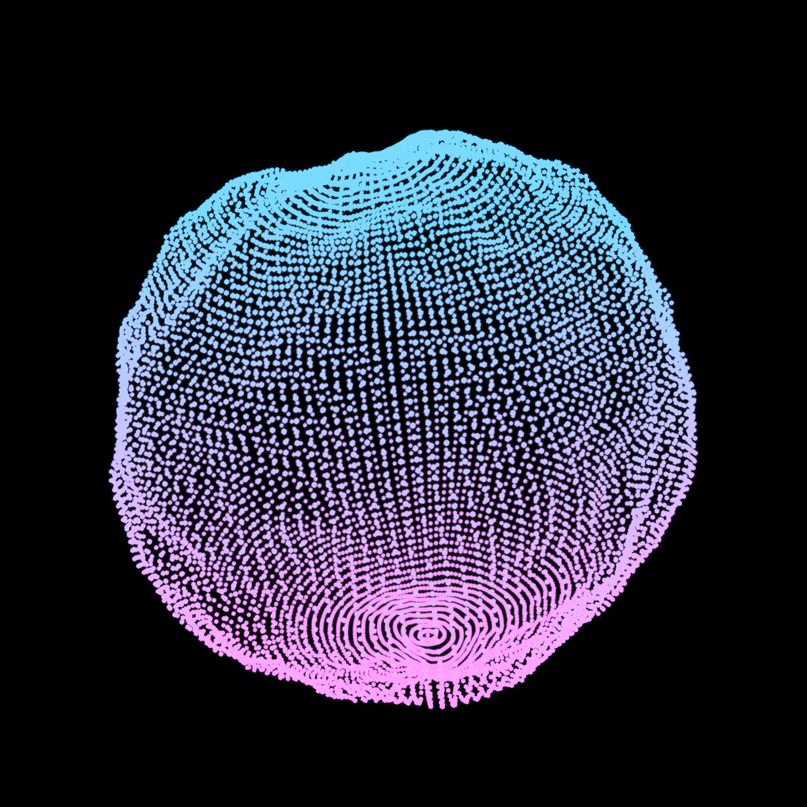

# Point Cloud Blob

Procedural Blender scene that generates a glowing point-cloud blob inspired by the reference image.



Live preview: <https://alevoldon.github.io/point-cloud-surface/>

## What's Included

- `make_point_cloud_blob.py` builds the scene from scratch with `bpy`
- `point_cloud_blob.blend` is the generated Blender scene
- `render/point_cloud_blob.png` is the preview render
- `docs/index.html` is a browser-based animation preview
- `FULL_PROCESS_GUIDE.md` explains the full build process
- `BLENDER_UI_STEP_BY_STEP.md` explains how to recreate it manually in Blender UI
- `PORTFOLIO_TEXTS.md` contains Russian and English project descriptions

## Requirements

- Blender 5.x
- Windows PowerShell commands below assume Blender is installed at:
  `C:\Program Files\Blender Foundation\Blender 5.0\blender.exe`

## Generate The Scene

Create the `.blend` file and render a PNG:

```powershell
& "C:\Program Files\Blender Foundation\Blender 5.0\blender.exe" `
  -b `
  --python ".\make_point_cloud_blob.py" `
  -- `
  --blend ".\point_cloud_blob.blend" `
  --render ".\render\point_cloud_blob.png"
```

Create the `.blend`, still render, and animation frame sequence:

```powershell
& "C:\Program Files\Blender Foundation\Blender 5.0\blender.exe" `
  -b `
  --python ".\make_point_cloud_blob.py" `
  -- `
  --blend ".\point_cloud_blob.blend" `
  --render ".\render\point_cloud_blob.png" `
  --animate ".\render\animation\frame_" `
  --frames 72 `
  --fps 24
```

The full animation frame sequence is generated into `render/animation/` locally and is ignored by git to keep the repository lightweight.

Create only the `.blend` file:

```powershell
& "C:\Program Files\Blender Foundation\Blender 5.0\blender.exe" `
  -b `
  --python ".\make_point_cloud_blob.py" `
  -- `
  --blend ".\point_cloud_blob.blend"
```

## Project Structure

```text
.
|- make_point_cloud_blob.py
|- point_cloud_blob.blend
|- render/
|  \- point_cloud_blob.png
|- docs/
|  \- index.html
|- FULL_PROCESS_GUIDE.md
|- BLENDER_UI_STEP_BY_STEP.md
\- PORTFOLIO_TEXTS.md
```

## How It Works

- A dense UV sphere is used as the source surface.
- Geometry Nodes displace the surface with layered noise.
- The deformed mesh is converted to points.
- A tiny `Ico Sphere` is instanced on each point.
- An emissive material applies a blue-to-magenta gradient with slight color variation.
- Eevee Bloom provides the glow.
- A lightweight looping animation is created by keyframing rotation, scale, and noise phase.

## Sharing

This repo is ready to upload as-is to GitHub. The Blender backup file `*.blend1` is ignored.

GitHub publishing notes are available in `GITHUB_SETUP.md`.

## Portfolio

Ready-to-use portfolio descriptions are available in `PORTFOLIO_TEXTS.md`.

## Release Notes

Prepared release notes are available in `RELEASE_NOTES_v1.1.0.md`.

## License

MIT
